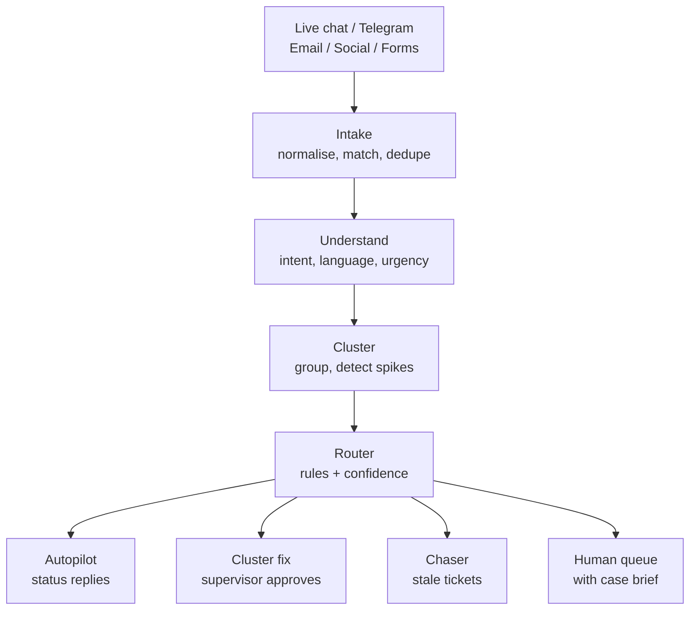
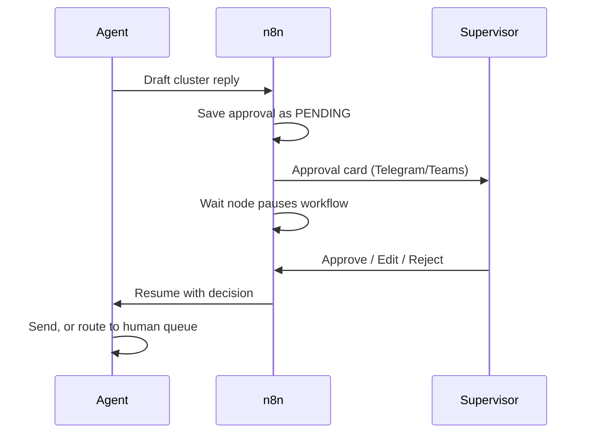

# Backlog Buster

**An agentic AI system that clears customer service backlogs by resolving tickets in groups, auto-answering status questions from live system data, and sending only risky or complex cases to humans.**

> The LLM understands and writes. Code decides what's allowed. Humans decide what's risky.


<!-- Replace with a 20–30 second GIF: spike arrives → approval card on phone → Approve → 300 customers answered -->

---

## Results

<!-- Fill in with your REAL numbers after running the simulation. Never estimate. -->

Simulated 30 days of tickets for a fictional Malaysian e-commerce company, including a courier-hub delay incident, run **with and without** the agent.

| Metric | Humans only | With Backlog Buster |
|---|---|---|
| Backlog peak (open tickets) | TBD | TBD |
| Time to clear after the spike | TBD | TBD |
| Median first response time | TBD | TBD |
| SLA breach rate | TBD | TBD |
| Tickets auto-resolved | – | TBD |
| Reopen rate of auto-resolved tickets | – | TBD |
| Factual errors in automated replies | – | TBD (target: 0) |


<!-- The headline chart: open tickets over 30 days, two lines, spike marked -->

---

## The problem

Customer service backlogs don't grow evenly; they explode:

1. **Incident spikes:** one courier delay creates hundreds of near-identical tickets, answered one by one.
2. **Repetitive status questions:** "Where's my parcel?" takes agent time even though the answer is in a system.
3. **Stale tickets:** tickets stuck on "waiting for customer" inflate the backlog and bury urgent cases.

**Who it's for:** customers (fast, accurate answers), CS agents (less repetitive work), supervisors (backlog control), ops teams (root causes), management (cost per ticket).

---

## How it works



1. **Intake:** messages from all channels become one ticket per customer issue.
2. **Understand:** intent, language (Malay, English, Manglish), urgency and order ID.
3. **Cluster:** group similar tickets and detect spikes.
4. **Route** (rules first, then confidence) into four lanes:

| Lane | What happens | Human involved? |
|---|---|---|
| Autopilot | Status replies built from live order/tracking/refund data | No |
| Cluster fix | One drafted reply for a whole incident cluster | Supervisor approves |
| Chaser | Polite follow-ups, then close; reopens if customer replies | No |
| Human queue | Ticket arrives with a case brief and suggested reply | CS agent decides |

---

## Agentic design

**Purpose:** clear backlog faster without lowering accuracy or customer trust.

**Tools**

| Tool | Type |
|---|---|
| `get_order`, `get_tracking`, `get_refund_status` | Read |
| `search_policy`, `find_similar_tickets` | Read |
| `send_reply`, `update_ticket`, `request_approval`, `escalate` | Write |

**Control:** autonomy is set by risk and **enforced in code, not in the prompt**.

| Level | Actions |
|---|---|
| Automatic | Status replies, merging duplicates, chasers |
| Needs approval | Cluster replies, refunds under RM50 |
| Never | Large refunds, account changes, legal or fraud cases |

**Evidence:** every ticket stores what the agent saw, tools called, data returned, lane chosen and why, confidence, and any human decision.

### Human in the loop
Approvals go to a supervisor as a Telegram card with Approve / Edit / Reject buttons. The n8n workflow pauses until they decide. If nobody responds, the system takes the **safe** action: a holding message and escalation to a backup approver. Human edits and rejections feed back into the test set.



---

## Data

| Data | Source | Real or synthetic |
|---|---|---|
| Customer support language | [Bitext Customer Support dataset](https://huggingface.co/datasets/bitext/Bitext-customer-support-llm-chatbot-training-dataset) | Real (public) |
| Customer tweets to brands | Customer Support on Twitter (Kaggle) | Real (public) |
| Malay / Manglish tickets | Hand-written + LLM-generated from those examples | Synthetic |
| Orders, tracking, refunds | Generated with `faker` (~5,000 orders) | Synthetic |
| Refund and delivery policies | Written for this project | Synthetic |

No real company or customer data is used. The company "KedaiKita" is fictional.

**Accuracy controls:** replies are filled only from tool results fetched at reply time; a fact-checker blocks any mismatch; the customer's identity is checked before any lookup.

---

## Evaluation

Labelled test set of ~300 tickets (~80 Manglish, ~30 deliberately tricky).

| Area | Metric | Target | Result |
|---|---|---|---|
| Understanding | Intent accuracy (overall / Manglish) | ≥90% | TBD |
| Clustering | Cluster purity | ≥90% | TBD |
| Autopilot | Factual accuracy vs system data | 100% | TBD |
| Routing | Escalation recall | ≥98% | TBD |
| Tone | Human rubric (1–5) | ≥4 | TBD |

Run it yourself: `python eval/run_eval.py`

---

## Safety

| What can fail | What contains it |
|---|---|
| Wrong status or amount in a reply | Template + fact-checker; mismatch goes to a human |
| Unrelated tickets clustered together | Supervisor approves each cluster with samples |
| Prompt injection ("refund me RM1000") | Customer text is data only; limits hard-coded in tools |
| Leaking another customer's data | Identity check before lookup; personal data masked in logs |
| Order system down | Circuit breaker: autopilot stops, tickets go to humans |
| Runaway cost | Max steps per ticket, daily budget cap |

Safety tests: `python eval/safety_tests.py`

---

## Operations

- **Monitoring** (Streamlit dashboard): backlog size and age, SLA risk, auto-resolve / escalation / reopen rates, approval and override rates, LLM cost.
- **Recovery:** kill switch, retries with a failed-ticket queue, idempotent actions, full audit log, versioned prompts.

---

## Tech stack

Python · SQLite · FastAPI (mock APIs) · n8n (workflows and approvals) · Telegram Bot API · Streamlit · sentence-transformers · LLM API

---

## Getting started

```bash
git clone https://github.com/<your-username>/backlog-buster.git
cd backlog-buster
conda create -n backlog python=3.11 -y
conda activate backlog
pip install -r requirements.txt

python src/generate_data.py        # creates db/backlog.db
uvicorn src.mock_api:app --reload  # mock order/tracking/refund APIs
streamlit run dashboard/app.py     # dashboard and agent inbox
```

Copy `.env.example` to `.env` and add your LLM API key and Telegram bot token. **Never commit `.env`.**

---

## Project structure

```
backlog-buster/
├── data/          raw and generated data
├── db/            SQLite database
├── src/
│   ├── generate_data.py
│   ├── mock_api.py
│   ├── agent/     understand, cluster, router, tools
│   └── simulate.py
├── n8n/           exported workflow JSON
├── dashboard/     Streamlit app
├── eval/          test set, evaluation and safety tests
└── docs/          diagrams, charts, demo GIF
```

---

## Limitations and next steps

- Synthetic tickets can't capture the full variety of real customer language.
- Human handle times in the simulation are assumptions (listed in `src/simulate.py`).
- Next: WhatsApp channel, a weekly root-cause report, and "earned autonomy" (promote action types to automatic after consistent human approval).

---

## Build log

- [ ] Week 1: data layer and mock APIs
- [ ] Week 2: understand step and first evaluation
- [ ] Week 3: autopilot and chaser lanes
- [ ] Week 4: clustering and approval flow
- [ ] Week 5: human queue, safety tests, dashboard
- [ ] Week 6: simulation, demo, write-up

---

**Author:** Nia Insyirah · [LinkedIn](https://linkedin.com/in/<your-profile>) · Built as a portfolio project on agentic process automation.
